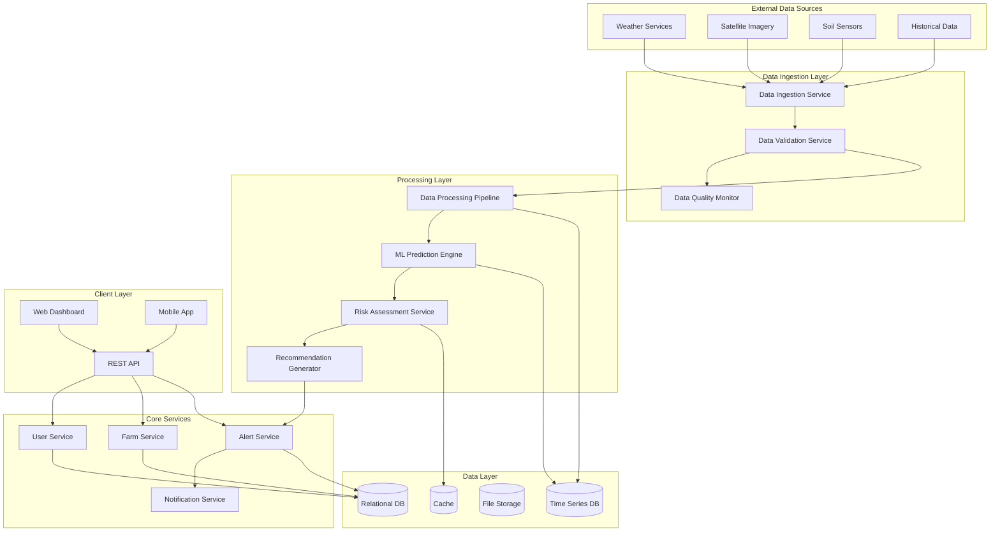

# Design Document: Agricultural Early Warning System

## Overview

The Agricultural Early Warning System is a cloud-native, AI-powered platform that provides farmers with predictive climate risk alerts and actionable crop protection recommendations. The system integrates multiple data sources including weather forecasts, satellite imagery, and soil sensors to generate accurate predictions with sufficient lead time for preventive action.

The architecture follows a microservices pattern with event-driven communication, enabling scalable data processing, real-time alerting, and continuous model improvement. The system is designed to handle 10,000+ concurrent farmers while maintaining sub-15-minute prediction latency and 99.5% uptime during critical growing seasons.

## Architecture

### High-Level Architecture



### Service Architecture

**Data Ingestion Layer:**
- **Data Ingestion Service**: Collects data from multiple external sources using configurable adapters
- **Data Validation Service**: Validates incoming data for completeness, accuracy, and format compliance
- **Data Quality Monitor**: Tracks data source reliability and triggers alerts for missing or degraded data

**Processing Layer:**
- **Data Processing Pipeline**: Transforms and normalizes data for ML model consumption
- **ML Prediction Engine**: Runs ensemble models to predict climate risks with confidence intervals
- **Risk Assessment Service**: Evaluates prediction outputs against farmer-specific thresholds
- **Recommendation Generator**: Creates tailored crop protection recommendations based on risk assessments

**Core Services:**
- **User Service**: Manages farmer authentication, profiles, and preferences
- **Farm Service**: Handles farm registration, crop profiles, and geographic boundaries
- **Alert Service**: Orchestrates alert generation, prioritization, and delivery scheduling
- **Notification Service**: Delivers alerts through multiple channels (SMS, email, push notifications)

## Components and Interfaces

### Data Ingestion Service

**Purpose**: Collect and standardize data from multiple external sources

**Key Components**:
- Weather Data Adapter: Integrates with meteorological APIs (NOAA, OpenWeather, local services)
- Satellite Image Processor: Downloads and preprocesses satellite imagery from providers
- Sensor Data Collector: Receives real-time data from IoT soil and weather sensors
- Data Scheduler: Manages polling intervals and retry logic for external sources

**Interfaces**:
```typescript
interface DataIngestionService {
  ingestWeatherData(source: WeatherSource, region: GeographicBounds): Promise<WeatherData[]>
  ingestSatelliteImagery(provider: SatelliteProvider, coordinates: Coordinates, date: Date): Promise<SatelliteImage>
  ingestSensorData(sensorId: string, timeRange: TimeRange): Promise<SensorReading[]>
  validateDataSource(source: DataSource): Promise<DataSourceStatus>
}

interface WeatherData {
  timestamp: Date
  location: Coordinates
  temperature: TemperatureReading
  humidity: number
  precipitation: PrecipitationData
  windSpeed: number
  windDirection: number
  pressure: number
  confidence: number
}
```

### ML Prediction Engine

**Purpose**: Generate climate risk predictions using ensemble machine learning models

**Key Components**:
- Model Manager: Loads, versions, and manages multiple prediction models
- Feature Engineering Pipeline: Transforms raw data into model-ready features
- Ensemble Predictor: Combines predictions from multiple models with confidence weighting
- Model Performance Monitor: Tracks prediction accuracy and triggers retraining

**Interfaces**:
```typescript
interface MLPredictionEngine {
  predictClimateRisks(farmData: FarmData, forecastHorizon: number): Promise<RiskPrediction[]>
  updateModels(historicalData: HistoricalData[]): Promise<ModelUpdateResult>
  evaluateModelPerformance(predictions: RiskPrediction[], actualOutcomes: Outcome[]): Promise<PerformanceMetrics>
  getModelConfidence(prediction: RiskPrediction): number
}

interface RiskPrediction {
  riskType: ClimateRiskType
  probability: number
  severity: RiskLevel
  timeWindow: TimeWindow
  affectedArea: GeographicBounds
  confidence: number
  contributingFactors: string[]
}
```

### Alert Service

**Purpose**: Generate, prioritize, and schedule delivery of climate risk alerts

**Key Components**:
- Alert Generator: Creates alerts based on risk predictions and farmer thresholds
- Priority Engine: Ranks alerts by severity, timing, and farmer preferences
- Delivery Scheduler: Manages alert timing to optimize farmer response time
- Alert History Tracker: Maintains records of sent alerts and farmer responses

**Interfaces**:
```typescript
interface AlertService {
  generateAlert(prediction: RiskPrediction, farmProfile: FarmProfile): Promise<Alert>
  prioritizeAlerts(alerts: Alert[]): Alert[]
  scheduleDelivery(alert: Alert, preferences: NotificationPreferences): Promise<DeliverySchedule>
  trackAlertResponse(alertId: string, response: AlertResponse): Promise<void>
}

interface Alert {
  id: string
  farmId: string
  riskType: ClimateRiskType
  severity: RiskLevel
  message: string
  recommendations: Recommendation[]
  deliveryTime: Date
  expirationTime: Date
  priority: number
}
```

### Recommendation Generator

**Purpose**: Create specific, actionable crop protection recommendations

**Key Components**:
- Recommendation Engine: Generates tailored recommendations based on crop profiles and risk types
- Resource Optimizer: Considers available resources and constraints when suggesting actions
- Effectiveness Ranker: Orders recommendations by predicted effectiveness and feasibility
- Timing Calculator: Determines optimal timing for recommended actions

**Interfaces**:
```typescript
interface RecommendationGenerator {
  generateRecommendations(risk: RiskPrediction, cropProfile: CropProfile): Promise<Recommendation[]>
  rankByEffectiveness(recommendations: Recommendation[], constraints: ResourceConstraints): Recommendation[]
  calculateActionTiming(recommendation: Recommendation, riskTimeWindow: TimeWindow): ActionTiming
  updateRecommendationEffectiveness(recommendationId: string, outcome: ActionOutcome): Promise<void>
}

interface Recommendation {
  id: string
  action: string
  description: string
  urgency: UrgencyLevel
  estimatedCost: number
  requiredResources: Resource[]
  expectedEffectiveness: number
  timeToImplement: number
  deadline: Date
}
```

## Data Models

### Core Domain Models

**Farm Profile**:
```typescript
interface FarmProfile {
  id: string
  farmerId: string
  name: string
  location: Coordinates
  boundaries: GeographicBounds[]
  totalArea: number
  crops: CropProfile[]
  soilType: SoilType
  irrigationSystem: IrrigationType
  equipment: Equipment[]
  createdAt: Date
  updatedAt: Date
}

interface CropProfile {
  id: string
  cropType: CropType
  variety: string
  plantingDate: Date
  expectedHarvestDate: Date
  growthStage: GrowthStage
  area: number
  location: GeographicBounds
  vulnerabilityPeriods: VulnerabilityPeriod[]
  protectionMeasures: ProtectionMeasure[]
}
```

**Risk Assessment Models**:
```typescript
interface RiskAssessment {
  id: string
  farmId: string
  assessmentTime: Date
  predictions: RiskPrediction[]
  overallRiskLevel: RiskLevel
  recommendedActions: string[]
  confidence: number
  dataQuality: DataQualityScore
}

interface ClimateRisk {
  type: ClimateRiskType
  severity: RiskLevel
  probability: number
  impactRadius: number
  duration: number
  peakIntensity: Date
  affectedCrops: string[]
}

enum ClimateRiskType {
  DROUGHT = 'drought',
  FROST = 'frost',
  EXCESSIVE_RAINFALL = 'excessive_rainfall',
  HAIL = 'hail',
  EXTREME_HEAT = 'extreme_heat',
  STRONG_WINDS = 'strong_winds'
}

enum RiskLevel {
  LOW = 'low',
  MEDIUM = 'medium',
  HIGH = 'high',
  CRITICAL = 'critical'
}
```

**User and Notification Models**:
```typescript
interface Farmer {
  id: string
  email: string
  phoneNumber: string
  name: string
  preferredLanguage: string
  timezone: string
  notificationPreferences: NotificationPreferences
  riskThresholds: RiskThresholds
  subscriptionPlan: SubscriptionPlan
  createdAt: Date
  lastLoginAt: Date
}

interface NotificationPreferences {
  channels: NotificationChannel[]
  quietHours: TimeRange
  urgencyFilters: UrgencyLevel[]
  groupSimilarAlerts: boolean
  maxAlertsPerDay: number
}

interface RiskThresholds {
  drought: RiskLevel
  frost: RiskLevel
  excessiveRainfall: RiskLevel
  hail: RiskLevel
  extremeHeat: RiskLevel
  strongWinds: RiskLevel
}
```

### Database Schema

**Time Series Data (InfluxDB)**:
```sql
-- Weather measurements
weather_data,location=farm_001,source=noaa temperature=25.5,humidity=65.2,precipitation=0.0 1640995200000000000

-- Sensor readings
sensor_data,sensor_id=soil_001,farm_id=farm_001 moisture=45.2,temperature=18.3,ph=6.8 1640995200000000000

-- Prediction results
predictions,farm_id=farm_001,risk_type=drought probability=0.75,severity=3,confidence=0.82 1640995200000000000
```

**Relational Data (PostgreSQL)**:
```sql
-- Farmers table
CREATE TABLE farmers (
    id UUID PRIMARY KEY DEFAULT gen_random_uuid(),
    email VARCHAR(255) UNIQUE NOT NULL,
    phone_number VARCHAR(20),
    name VARCHAR(255) NOT NULL,
    preferred_language VARCHAR(10) DEFAULT 'en',
    timezone VARCHAR(50) DEFAULT 'UTC',
    notification_preferences JSONB,
    risk_thresholds JSONB,
    created_at TIMESTAMP DEFAULT NOW(),
    updated_at TIMESTAMP DEFAULT NOW()
);

-- Farms table
CREATE TABLE farms (
    id UUID PRIMARY KEY DEFAULT gen_random_uuid(),
    farmer_id UUID REFERENCES farmers(id) ON DELETE CASCADE,
    name VARCHAR(255) NOT NULL,
    location POINT NOT NULL,
    boundaries POLYGON,
    total_area DECIMAL(10,2),
    soil_type VARCHAR(50),
    irrigation_type VARCHAR(50),
    created_at TIMESTAMP DEFAULT NOW(),
    updated_at TIMESTAMP DEFAULT NOW()
);

-- Crops table
CREATE TABLE crops (
    id UUID PRIMARY KEY DEFAULT gen_random_uuid(),
    farm_id UUID REFERENCES farms(id) ON DELETE CASCADE,
    crop_type VARCHAR(100) NOT NULL,
    variety VARCHAR(100),
    planting_date DATE,
    expected_harvest_date DATE,
    growth_stage VARCHAR(50),
    area DECIMAL(8,2),
    location POLYGON,
    vulnerability_periods JSONB,
    protection_measures JSONB,
    created_at TIMESTAMP DEFAULT NOW(),
    updated_at TIMESTAMP DEFAULT NOW()
);

-- Alerts table
CREATE TABLE alerts (
    id UUID PRIMARY KEY DEFAULT gen_random_uuid(),
    farm_id UUID REFERENCES farms(id) ON DELETE CASCADE,
    risk_type VARCHAR(50) NOT NULL,
    severity VARCHAR(20) NOT NULL,
    message TEXT NOT NULL,
    recommendations JSONB,
    delivery_time TIMESTAMP,
    expiration_time TIMESTAMP,
    priority INTEGER DEFAULT 0,
    status VARCHAR(20) DEFAULT 'pending',
    created_at TIMESTAMP DEFAULT NOW()
);

-- Alert responses table
CREATE TABLE alert_responses (
    id UUID PRIMARY KEY DEFAULT gen_random_uuid(),
    alert_id UUID REFERENCES alerts(id) ON DELETE CASCADE,
    farmer_id UUID REFERENCES farmers(id) ON DELETE CASCADE,
    response_type VARCHAR(50),
    action_taken TEXT,
    effectiveness_rating INTEGER CHECK (effectiveness_rating >= 1 AND effectiveness_rating <= 5),
    notes TEXT,
    created_at TIMESTAMP DEFAULT NOW()
);
```

## Technology Stack

### Backend Services
- **Runtime**: Node.js with TypeScript for type safety and developer productivity
- **Framework**: Express.js with Helmet for security and compression middleware
- **API Documentation**: OpenAPI 3.0 with Swagger UI for interactive documentation
- **Authentication**: JWT tokens with refresh token rotation and role-based access control

### Data Storage
- **Time Series Database**: InfluxDB for weather data, sensor readings, and prediction results
- **Relational Database**: PostgreSQL for user profiles, farm configurations, and alert history
- **File Storage**: AWS S3 for satellite imagery and model artifacts with lifecycle policies
- **Caching**: Redis for session management and frequently accessed prediction results

### Machine Learning
- **ML Framework**: Python with scikit-learn for traditional ML and TensorFlow for deep learning models
- **Model Serving**: TensorFlow Serving for production model deployment with A/B testing
- **Feature Store**: Feast for feature engineering pipeline and feature versioning
- **Model Monitoring**: MLflow for experiment tracking and model performance monitoring

### Infrastructure
- **Container Orchestration**: Kubernetes for service deployment and auto-scaling
- **Message Queue**: Apache Kafka for event streaming and service decoupling
- **API Gateway**: Kong for rate limiting, authentication, and request routing
- **Monitoring**: Prometheus + Grafana for metrics and Jaeger for distributed tracing
- **Logging**: ELK Stack (Elasticsearch, Logstash, Kibana) for centralized logging

### External Integrations
- **Weather APIs**: NOAA, OpenWeatherMap, and regional meteorological services
- **Satellite Imagery**: Sentinel-2, Landsat-8 through Google Earth Engine API
- **Notification Services**: Twilio for SMS, SendGrid for email, Firebase for push notifications
- **Mapping Services**: Mapbox for geographic visualization and boundary management
## Correctness Properties

*A property is a characteristic or behavior that should hold true across all valid executions of a system—essentially, a formal statement about what the system should do. Properties serve as the bridge between human-readable specifications and machine-verifiable correctness guarantees.*

### Property 1: Weather Data Processing Completeness
*For any* valid weather data input, the system should analyze it using prediction models and produce a risk assessment with probability, severity, and confidence values within valid ranges.
**Validates: Requirements 1.1, 1.2**

### Property 2: Multi-Source Data Integration
*For any* prediction scenario with multiple data sources available, the resulting prediction confidence should be higher than or equal to predictions made with single data sources.
**Validates: Requirements 1.3**

### Property 3: Prediction Lead Time Compliance
*For any* actionable risk prediction generated by the system, the lead time should be at least 24 hours before the predicted event occurrence.
**Validates: Requirements 1.4**

### Property 4: Low Confidence Uncertainty Marking
*For any* prediction with confidence below 70%, the system should include uncertainty indicators in the forecast output.
**Validates: Requirements 1.5**

### Property 5: Threshold-Based Alert Generation
*For any* climate risk that exceeds a farmer's configured threshold, the system should generate an alert with appropriate priority and content.
**Validates: Requirements 2.1**

### Property 6: Alert Delivery Channel Compliance
*For any* generated alert, the system should deliver it through all communication channels specified in the farmer's preferences.
**Validates: Requirements 2.2**

### Property 7: Alert Content Completeness
*For any* generated alert, it should contain risk level, affected area, timing, confidence level, and specific crop protection recommendations with timing and resource requirements.
**Validates: Requirements 2.3, 3.1, 3.4**

### Property 8: Multi-Risk Alert Prioritization
*For any* set of simultaneous risk predictions, the generated alerts should be ordered by severity first, then by timing proximity.
**Validates: Requirements 2.4**

### Property 9: High-Severity Alert Timing
*For any* alert with High or Critical risk level, the delivery time should be at least 12 hours before the predicted event.
**Validates: Requirements 2.5**

### Property 10: Recommendation Customization
*For any* two farms with different crop types, growth stages, or available resources, the recommendations generated for the same risk type should differ appropriately.
**Validates: Requirements 3.2**

### Property 11: Recommendation Ranking
*For any* scenario with multiple protection options, the recommendations should be ranked with effectiveness and feasibility scores in descending order.
**Validates: Requirements 3.3**

### Property 12: Emergency Recommendation Marking
*For any* time-critical recommendation, it should be clearly marked with emergency indicators and priority flags.
**Validates: Requirements 3.5**

### Property 13: Data Source Integration Robustness
*For any* combination of available weather services and satellite imagery sources, the system should successfully process and integrate the data into coherent assessments.
**Validates: Requirements 4.1, 4.2**

### Property 14: Data Source Failure Resilience
*For any* scenario where data sources become unavailable, the system should continue operating with remaining sources and generate administrator notifications.
**Validates: Requirements 4.3**

### Property 15: Data Update Frequency
*For any* 6-hour period during system operation, predictions should be updated at least once with newly available data.
**Validates: Requirements 4.4**

### Property 16: Data Validation Enforcement
*For any* incoming data that is invalid or incomplete, the system should reject it, while valid and complete data should be processed successfully.
**Validates: Requirements 4.5**

### Property 17: Configuration Storage and Retrieval
*For any* farmer configuration data (farm boundaries, crop types, risk thresholds, communication preferences), the system should store it accurately and retrieve it correctly for future use.
**Validates: Requirements 5.1, 5.2, 5.3, 5.4**

### Property 18: Configuration Change Immediate Application
*For any* farmer configuration update, subsequent predictions should immediately reflect the new configuration parameters.
**Validates: Requirements 5.5**

### Property 19: Historical Data Storage Completeness
*For any* weather data, prediction, or actual outcome, the system should store it in historical records and make it available for future analysis.
**Validates: Requirements 6.1**

### Property 20: Model Accuracy Improvement
*For any* prediction model retrained with additional historical data, the accuracy metrics should be equal to or better than the previous version.
**Validates: Requirements 6.2**

### Property 21: Feedback Integration
*For any* farmer feedback on recommendation effectiveness, future recommendations of the same type should incorporate the feedback to improve relevance.
**Validates: Requirements 6.3**

### Property 22: Regional Pattern Enhancement
*For any* local prediction, incorporating regional pattern analysis should result in equal or improved prediction accuracy compared to purely local data.
**Validates: Requirements 6.4**

### Property 23: Model Retraining Schedule
*For any* monthly period during system operation, prediction models should be retrained at least once using accumulated historical data.
**Validates: Requirements 6.5**

### Property 24: Processing Time Performance
*For any* new data received by the system, predictions should be generated and available within 15 minutes of data receipt.
**Validates: Requirements 7.2**

### Property 25: Component Failover Behavior
*For any* system component failure, backup systems should automatically take over operations without service interruption.
**Validates: Requirements 7.3**

### Property 26: Alert Delivery Timing
*For any* generated alert, it should be delivered to farmers within 5 minutes of generation.
**Validates: Requirements 7.4**

### Property 27: Data Encryption Compliance
*For any* farmer data stored or transmitted by the system, it should be encrypted using approved encryption standards.
**Validates: Requirements 8.1**

### Property 28: Authentication Requirement Enforcement
*For any* system endpoint or data access request, valid authentication should be required and verified.
**Validates: Requirements 8.2**

### Property 29: Data Deletion Compliance
*For any* farmer data deletion request, all personal information should be completely removed from the system within 30 days.
**Validates: Requirements 8.3**

### Property 30: Audit Logging Completeness
*For any* data access or modification operation, appropriate audit log entries should be created with timestamp, user, and action details.
**Validates: Requirements 8.4**

## Error Handling

### Data Source Failures
- **Graceful Degradation**: When primary weather services are unavailable, the system falls back to secondary sources and adjusts confidence levels accordingly
- **Notification System**: Administrators receive immediate alerts when data sources fail, including estimated impact on prediction accuracy
- **Retry Logic**: Exponential backoff retry mechanisms for temporary service outages with circuit breaker patterns to prevent cascade failures

### Prediction Model Failures
- **Model Ensemble Fallback**: If primary ML models fail, the system uses simpler statistical models to maintain basic functionality
- **Confidence Adjustment**: Prediction confidence scores are automatically reduced when operating with degraded model capabilities
- **Model Health Monitoring**: Continuous monitoring of model performance with automatic rollback to previous versions if accuracy degrades significantly

### Alert Delivery Failures
- **Multi-Channel Redundancy**: If primary notification channels fail, alerts are automatically sent through backup channels
- **Delivery Confirmation**: System tracks delivery confirmations and retries failed deliveries with escalating urgency
- **Farmer Notification**: Farmers are notified through alternative channels if their primary communication method is unavailable

### Data Quality Issues
- **Validation Pipeline**: Multi-stage data validation with automatic rejection of data that fails quality checks
- **Quality Scoring**: All data sources receive quality scores that influence their weight in prediction models
- **Manual Review Queue**: Suspicious data is flagged for manual review while the system continues operating with validated data

### System Overload Scenarios
- **Load Balancing**: Automatic scaling of processing resources during peak demand periods
- **Priority Queuing**: Critical alerts are processed with higher priority during system overload
- **Rate Limiting**: API rate limiting prevents individual users from overwhelming the system

## Testing Strategy

### Dual Testing Approach

The Agricultural Early Warning System requires both unit testing and property-based testing to ensure comprehensive coverage and correctness validation.

**Unit Testing Focus:**
- Specific examples of weather data processing and risk prediction scenarios
- Edge cases such as extreme weather conditions and boundary value testing
- Integration points between services and external API interactions
- Error conditions and failure scenarios for each component
- Authentication and authorization workflows

**Property-Based Testing Focus:**
- Universal properties that hold across all possible inputs and scenarios
- Comprehensive input coverage through randomized test data generation
- Validation of system behavior under diverse conditions
- Correctness properties derived from requirements specifications

### Property-Based Testing Configuration

**Testing Framework**: Use Hypothesis for Python components and fast-check for TypeScript/JavaScript components to implement property-based tests.

**Test Configuration:**
- Minimum 100 iterations per property test to ensure statistical significance
- Each property test must reference its corresponding design document property
- Tag format: **Feature: agricultural-early-warning-system, Property {number}: {property_text}**

**Example Property Test Structure:**
```python
@given(weather_data=weather_data_strategy(), farm_profile=farm_profile_strategy())
def test_weather_data_processing_completeness(weather_data, farm_profile):
    """
    Feature: agricultural-early-warning-system, Property 1: Weather Data Processing Completeness
    For any valid weather data input, the system should analyze it using prediction models 
    and produce a risk assessment with probability, severity, and confidence values within valid ranges.
    """
    result = prediction_engine.analyze_weather_data(weather_data, farm_profile)
    
    assert result is not None
    assert 0.0 <= result.probability <= 1.0
    assert result.severity in [RiskLevel.LOW, RiskLevel.MEDIUM, RiskLevel.HIGH, RiskLevel.CRITICAL]
    assert 0.0 <= result.confidence <= 1.0
```

### Integration Testing Strategy

**End-to-End Scenarios:**
- Complete data ingestion to alert delivery workflows
- Multi-farmer concurrent usage scenarios
- Data source failure and recovery testing
- Model retraining and deployment validation

**Performance Testing:**
- Load testing with 10,000 concurrent farmers
- Stress testing of prediction generation under peak data loads
- Latency testing for alert delivery timing requirements
- Scalability testing for data processing pipelines

### Monitoring and Observability

**Metrics Collection:**
- Prediction accuracy tracking with historical validation
- Alert delivery success rates and timing metrics
- Data source availability and quality scores
- System performance and resource utilization

**Alerting Thresholds:**
- Prediction accuracy drops below 80%
- Alert delivery failures exceed 1%
- Data processing latency exceeds 15 minutes
- System availability drops below 99.5%

**Dashboard Requirements:**
- Real-time system health and performance metrics
- Prediction accuracy trends and model performance
- Farmer engagement and alert response rates
- Data source reliability and quality indicators